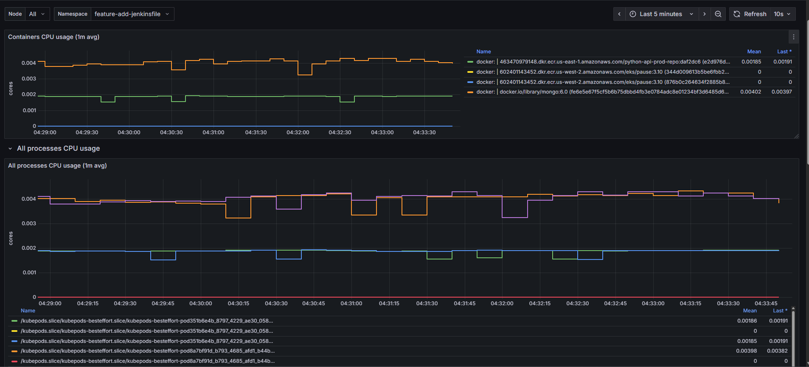
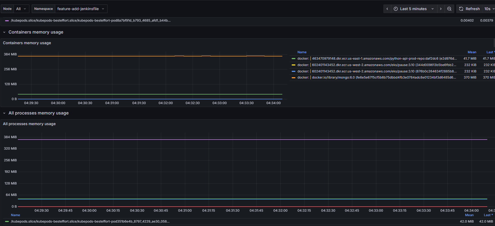
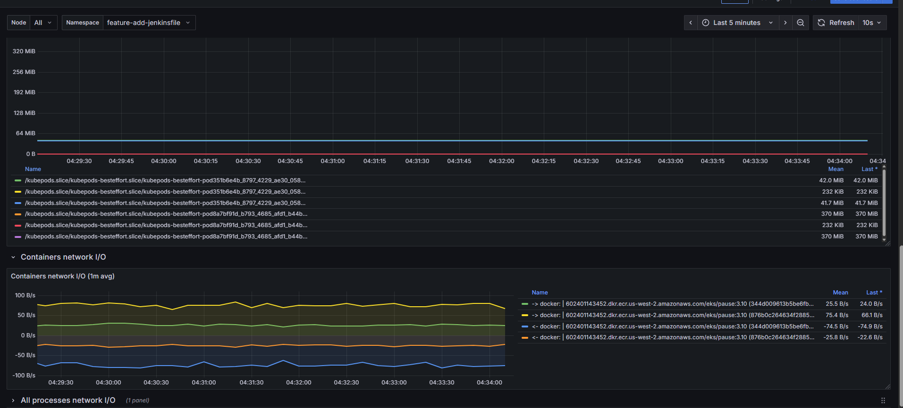

# monitoring


A repository for configuring and deploying the **monitoring** stack for containers and services.  
It includes custom dashboards, configuration files, and a CI/CD pipeline powered by **Jenkins**.

---

## 📁 Project Structure

```bash
.
├── CHANGELOG.md              # Version change log
├── Jenkinsfile               # Jenkins pipeline for automated deployment
├── README.md                 # Project documentation
├── dashboard/
│   └── container-dashboard.json   # Grafana dashboard for container monitoring
└── values-monitoring.yaml    # Monitoring configuration values (Helm/Prometheus)


## dashboard



